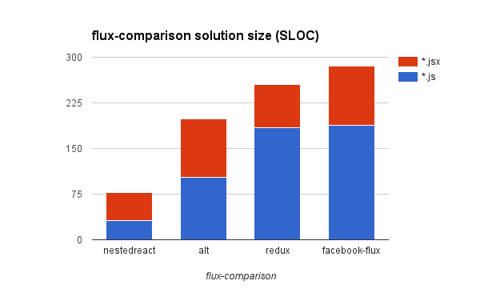

NestedReact is the front-end framework which brings advantages of React's view layer
to the classic MVC architecture which is familiar to the most application developers. You've got the complete solution
covering all needs of large SPA _except_ the routing (choose the one which suites you best).

- *Models* as data layer building blocks:
    - looks like plain JS classes;
    - recursively composable (can consists of other models and collections);
    - deeply observable ("reactive");
    - automatically serializable (any model can be instantly turned to the REST endpoint);
    - aware of one-to-many and many-to-many relations out of the box.
- Unified state management. No more `component.setState()`:
    - component's state is the *model* (looks like plain object, observable, serializable, etc);
    - components observes state changes and update itself.
- Forms handling as you expect it to be in XXIst century:
    - completely declarative;
    - two-way data binding;
    - form inputs validation.
- Unidirectional data flow and pure render.
    - No tricks. No mind-blowing concepts or crazy looking code. It just works.
- React Mixins support for ES6 classes components.
- Easy migration from BackboneJS, if you need it. 

NestedReact is built around NestedTypes data framework (for M), React (for V), and don't enforce any routing solution (unopinionated on C).

NestedTypes is the data framework which basically does the same thing to data that React does to DOM:
- it helps you to describe object trees in declarative way;
- it updates existing (mutable) object trees in place applying the difference of existing objects to the JSON received from the server.
- it triggers change events only when there are _real_ changes. 

## Basic Usage

NestedReact exports modified React namespace (original React is untouched). So, use it as React replacement like this:

```javascript
import React from 'nestedreact'
```

The most important thing NestedReact does is universal state management; the same technique is used for
handling both component's local UI state, persistent data, and shared global state. In the simplest case of the local UI state,
it looks to your as if your state just instantly became observable. You handle the flat state as if it would be the plain object.

```javascript
export const MyComponent = React.createClass({
	state : {
		count : 0
	},

	render(){
	    const { state } = this;
		
		return (
			<div onClick={ () => state.count++ }>
				{ state.count }
			</div>
		);
	}
});
```

In case of ES6 classes components specification members becomes statics
 and definition must be preceded with the `@define` decorator.

```javascript
import React, { define } from 'nestedreact'

@define
export class MyComponent extends React.Component {
	static state = {
		count : 0
	}

	render(){
	    const { state } = this;
		
		return (
			<div onClick={ () => state.count++ }>
				{ state.count }
			</div>
		);
	}
}
```

If you prefer to avoid decorators, just invoke component's static `define()` method directly after the class definition.

```javascript
MyComponent.define();
```

If you prefer to avoid inline statics, you may pass the specification directly to the `define()` method:

```javascript
MyComponent.define({
    state : {
		count : 0
	}
});
```

## Installation

All modern browsers and IE10+ are supported. Packed as UMD, can be installed using npm.

Requires `nestedtypes`, `react`, and `react-dom` as a peer dependencies.

*NestedTypes* itself can be used as a drop-in *BackboneJS* replacement,
 and thus requires `jquery` and `underscore` as peer dependencies. Therefore:

`npm install react react-dom nestedreact nestedtypes jquery underscore --save-dev`

See examples in the [examples folder](https://github.com/Volicon/NestedReact/tree/master/examples)
for the starting boilerplate.

## Optimizing for size

If you're not interested in legacy technologies support and would like to reduce the
size of your app assembly, wait a bit for stripped version which is one the way.
Meanwhile, you can:

- Omit jQuery. Without that Model/Collection REST endpoints and Backbone shims will stop working.
- Use lightweight jQuery replacements in the same way as people do with Backbone.
- Don't bother and enjoy. That extra legacy stuff is really the small fraction of the assembly.

## Why another JS framework

React was the huge advancement over client side templating solutions used
previously for "V" in the majority of MVC frameworks. Unfortunately, we
 don't feel the same about the application state management architectures 
 being [advocated by Facebook](https://facebook.github.io/flux/).
  
As our framework clearly demonstrates, it _is_ possible to implement
unidirectional data flow with "dirty" mutable data.

And it's not only possible, but [highly beneficial](https://medium.com/@gaperton/software-managing-the-complexity-caff5c4964cf#.dn3aq4riy).
Here's [TodoMVC](http://todomvc.com/) solution size chart for different
frameworks and combinations of tools:


As you can see, an old-school MVC approach the majority of developers are perfectly familiar with [allowing us to write twice less 
code](https://github.com/Volicon/NestedReact/tree/master/examples/todomvc) for the same task than all the "flux" stuff. So the overall result is comparable
 to Angular 2. We're in the same league now.
 
If you take [flux-comparison](https://github.com/voronianski/flux-comparison) example, difference will become even more spectacular.



Here's our [solution](https://github.com/Volicon/NestedReact/tree/master/examples/flux-comparison). Check it out.