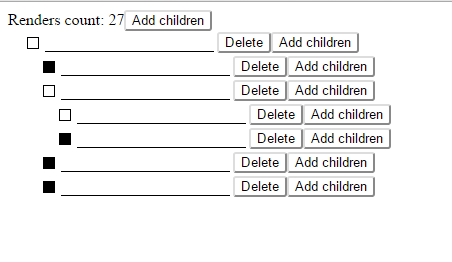

# Hiearchical Checklist.

Classic hierarchical checklist example, which you could often see in installers. 
This is checklist with a rule. Item is checked, if all children are checked. 

54 SLOC for jsx components, 28 for the model definition.

This example demostrate several features of the NestedTypes state management.

- Recursive definitions. Model can mention itself in its attribute specs, thus, it's possible to define
    (potentially) infinite recursive data structures.
- Change watchers. It's possible to attach 'watchers' to any attribute, which would be called on value change.
- Transactional updates. Any change made to the model from the watcher is being added to the current transaction,
    resulting in the single 'change' event per transaction. Look at the render count in the example - you've got one
    render no matter how many checkboxes was flipped.