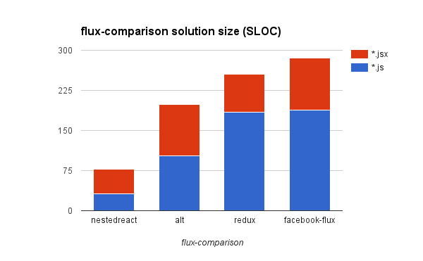
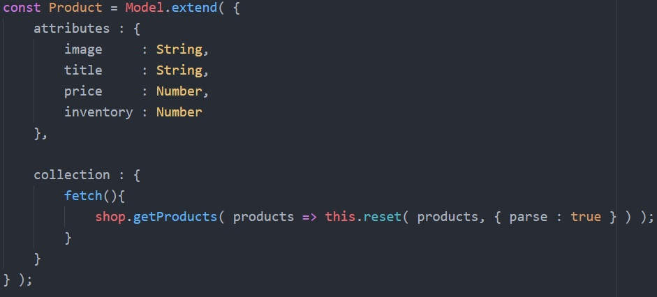
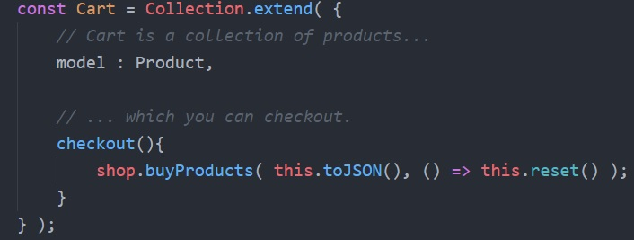

# Flux Comparison by Example

There's great comparison of popular React flux implementation, made by Dmitri Voronianski.  

> Similar app implemented with different [Flux](https://facebook.github.io/flux/) solutions including Facebook's, Yahoo's and others.

## Demo

Select several products from _Flux Online Shop_ and add them to cart. Open browser console and click _Checkout_ button, you'll see payload with products that you just "bought".

http://labs.voronianski.com/flux-comparison

**You may find few notes about all implementations from author's ; [blog](http://pixelhunter.me/post/110248593059/flux-solutions-compared-by-example).**

Discussion on HackerNews - https://news.ycombinator.com/item?id=8989495.

## NestedReact implementation notes

It's really hard to dig through them all, especially considering the fact
that if you trained to read flux code for one particular implementation,
it doesn't mean that you will understand another one.

So, let's take solutions for some popular flux libraries, and look at them
 through the diagram with solution size first. And see how they compares to
each other and typical NestedReact coding style.

If you will measure data layer size for all of them (it's blue bars in our  chart), you'll find out that
there are two groups of flux solutions. One of them with data layer size closer
to (but not less than) 100 SLOC, with `alt` being one of the shortest.
And another one, which is closer to 200, with `redux` being one of the longest.

Meanwhile, if you look at NestedTypes code, you will
understand how ridiculously trivial this data layer is.
Enough words, let's see what we're talking about.

So, they have products. Which is, essentially, this thing:

And cart. Which is just another collection of products.

That's it. On a longer example, difference will become even bigger. Why? Because, we got quite [advanced facilities to
deal with complex data](https://github.com/Volicon/NestedTypes/blob/master/docs/RelationsGuide.md) up our sleeve, which will come into play. They don't.
